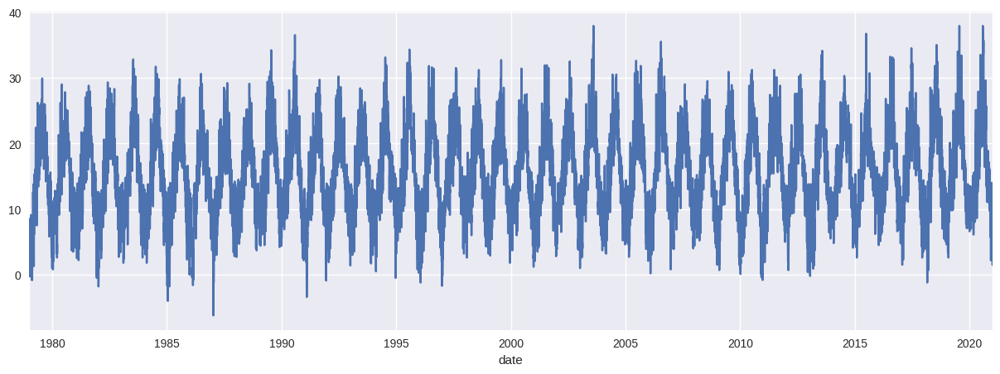
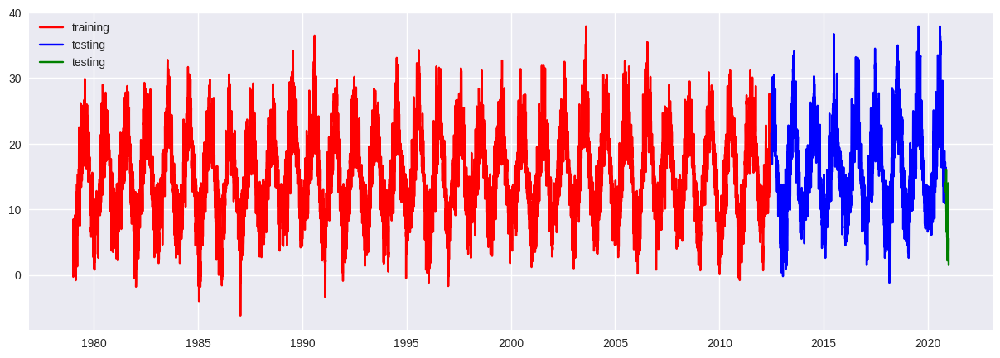
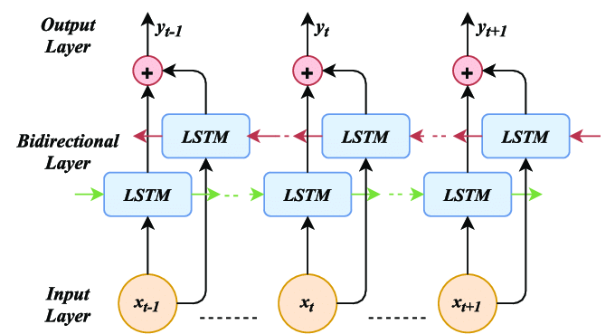
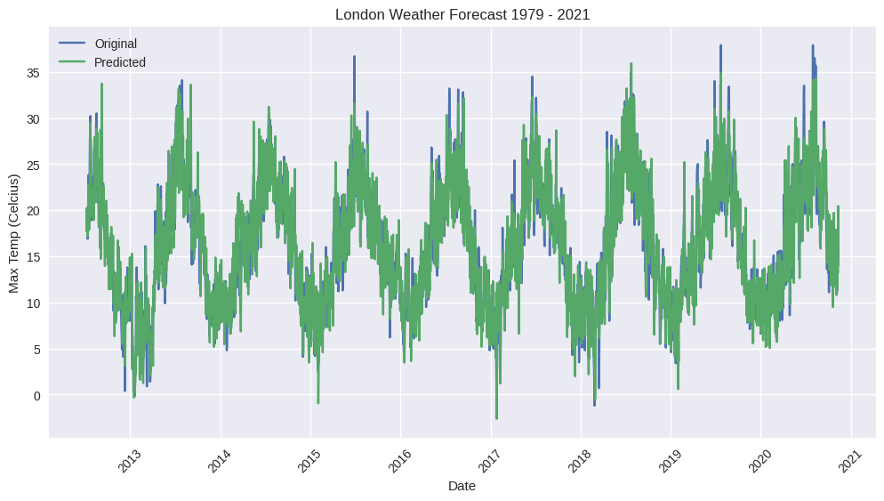
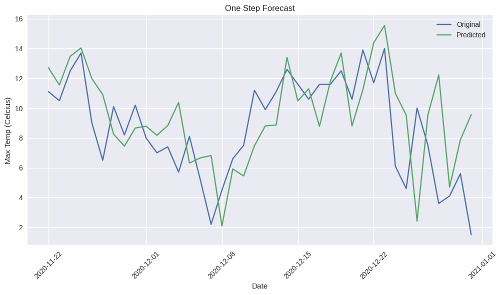
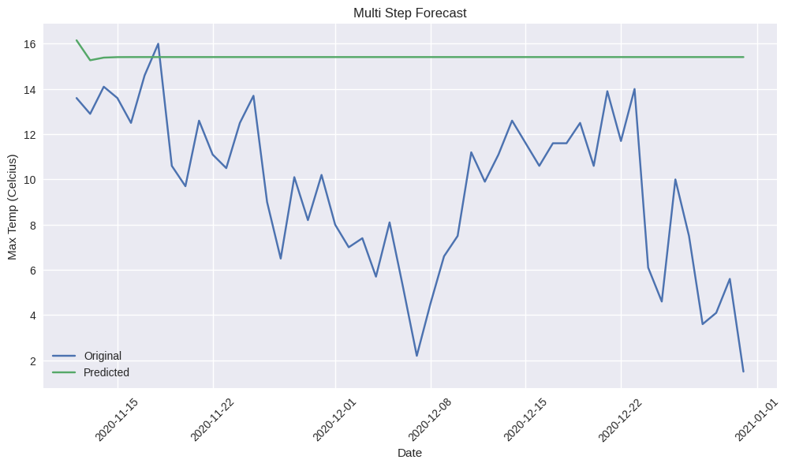

# London Weather Forecasting

London is very historical yet distinct place with changing weather condition. So a tool like weather forecast is really a handy thing to have in our pockets. I tend to build that tool. As a side its not a new thing, weather have much bigger forecasters. I just wanted to try that out, out of curiosity. 

## Data
I collected London weather data from kaggle, which contains Historical London weather data from 1979 to 2021. The dataset was created by reconciling measurements from requests of individual weather attributes provided by the European Climate Assessment (ECA). The measurements of this particular dataset were recorded by a weather station near Heathrow airport in London, UK.

-> This weather dataset is a great addition to this London Energy Dataset. You can join both datasets on the 'date' attribute, after some preprocessing, and perform some interesting data analytics regarding how energy consumption was impacted by the weather in London.

The size for the file featured within that Kaggle dataset is shown below — along with a list of attributes and their description summaries:

london_weather.csv - 15341 observations x 10 attributes

date - recorded date of measurement - (int)

cloud_cover - cloud cover measurement in oktas - (float)

sunshine - sunshine measurement in hours (hrs) - (float)

global_radiation - irradiance measurement in Watt per square meter (W/m2) - (float)

max_temp - maximum temperature recorded in degrees Celsius (°C) - (float)

mean_temp - mean temperature in degrees Celsius (°C) - (float)

min_temp - minimum temperature recorded in degrees Celsius (°C) - (float)

precipitation - precipitation measurement in millimeters (mm) - (float)

pressure - pressure measurement in Pascals (Pa) - (float)

snow_depth - snow depth measurement in centimeters (cm) - (float)

Whereas the Weather Data Soure is - https://www.ecad.eu/dailydata/index.php

Here I would be only interested in max_temp column which has been projected below as.

## Data Preparation

First I split the data to last 50 samples as for testing, 80% of remaining data for training and 20% for validation.

Once the split was done I preprocessed the entire data using sklearn MinMaxScaler. Lastly transformed it with sequence size of 10.

## Model

Once the data was prepared I hooked up on to building a Model. BiLSTM is one the latest model for forecasting tasks such as this one, before the rise of transformers. Therefore I had decided to built this on. I have 4 BiLSTM layers of size 50, 80, 80 and 50, with ending on 1 Dense layer.

## Training

I trained the model on 500 epochs with Adam optimizer and Mean Squared Error loss function. And results were quite cool by the way

Having Root Mean Squared Error of about 0.07 and Mean Absolute Percentage Error of about 12.02%

And beautiful validation Results.

## One Step Forecast

I tried one step forecast with it on test dataset which are of 50 samples that I put aside and following were the results.

## Multi Step Forecast

After One Step Forecast I did multi step forecast which really involves predicting future values of a time series over multiple time steps ahead. It requires models that can capture dependencies and patterns across these steps for accurate predictions.

